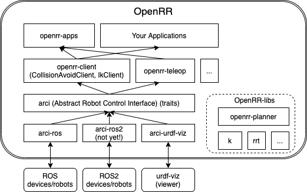

# openrr: `Open Rust Robotics`

 [](https://crates.io/crates/openrr) [](https://codecov.io/gh/openrr/openrr) [](https://docs.rs/openrr)

OpenRR (pronounced like "opener") is Open Rust Robotics platform.

**It's heavily under development.**

## Supported Platforms

|OS|Core|GUI|ROS|
|--|----|---|---|
|Linux (Ubuntu)|✔|✔|✔|
|MacOS|✔|✔|✔|
|Windows|✔|✔| |

## Dependencies

### Linux

```bash
sudo apt install cmake build-essential libudev-dev xorg-dev libglu1-mesa-dev libasound2-dev
```

* cmake build-essential (openrr-planner (assimp-sys))
* libudev-dev (arci-gamepad-gilrs)
* xorg-dev libglu1-mesa-dev (openrr-gui (iced))
* libasound2-dev (arci-speak-audio)

## Architecture



`arci` is a hardware abstraction layer for openrr.
Currently [ROS1](https://ros.org) and [urdf-viz](https://github.com/openrr/urdf-viz) (as a static simulator (actually it's just a viewer)) are implemented.

You can write platform/hardware independent code if you use `arci` traits.

## What is OpenRR?

OpenRR contains..

* abstract robot interfaces (`arci`)
* concrete implementation of the interfaces (`arci-ros`, `arci-urdf-viz`, ...)
* library which uses the interfaces (`openrr-client`, ...)
* tools (`openrr-apps`)
* pure libraries nothing to do with `arci` (`openrr-planner`, `openrr-sleep`, ...)

## Tools

Currently we have some tools to control real/sim robots.

See [openrr-apps](https://github.com/openrr/openrr/tree/main/openrr-apps) for details.

### joint_trajectory_sender

Inspired by [joint_state_publisher_gui](http://wiki.ros.org/joint_state_publisher)


You can use this GUI not only for ROS but anything if you implement `arci::JointTrajectoryClient` and write a small binary main function.

### robot_command

General CLI to access `arci` robot clients. It supports not only sending joint trajectory directly but it supports inverse kinematics with self-collision check, and navigation.

## License

Apache2

## Related openrr repositories

* [k](https://github.com/OpenRR/k) : kinematics library
* [ros-nalgebra](https://github.com/OpenRR/ros-nalgebra) : rosrust nalgebra converter generator
* [rrt](https://github.com/OpenRR/rrt) : RRT-dual-connect path planner
* [trajectory](https://github.com/OpenRR/trajectory) : trajectory interpolator
* [urdf-rs](https://github.com/OpenRR/urdf-rs) : URDF parser
* [urdf-viz](https://github.com/OpenRR/urdf-viz): URDF visualizer
* ~~[gear](https://github.com/OpenRR/gear)~~ : (deprecated) motion planning library, but it is openrr-planner now.

## Why OpenRR?

We strongly believe that Rust is the future of robotics.
OpenRR is the world first robotics platform which is made by Rust, made for Rust.
It can be a reference, a base for the future robotic people, like us.

## Contribution

We appreciate for your any contributions!
[Create an issue](https://github.com/openrr/openrr/issues/new) at first!
